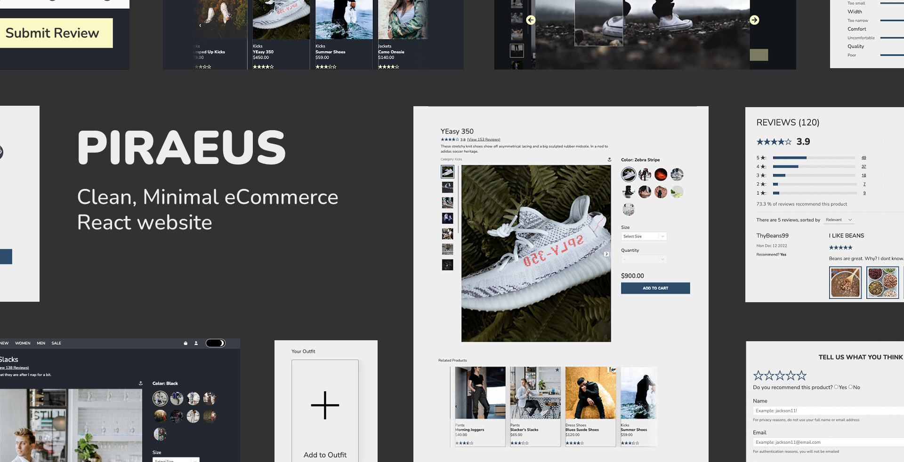

# Piraeus Retail Web-Portal

## Overview

This project is a single-page e-commerce website. This platform offers users an interactive UI where they can explore products or services available for purchase. Notable features encompass the ability to write reviews, and upload photos through a RESTful API.

With the provided wireframe layout, our trio of software engineers was tasked with crafting a front-end that both mirrored the design and adhered to a set of feature specifications.


## Components
1. Product Overview
1. Related Products
1. Ratings & Reviews
   
## Usage

1. **Install the required dependencies**:
    ```bash
    npm install
    ```

2. **Start the development server**:
    Rename the example.env to .env, and replace the AUTH key.
    ```bash
    npm run server-dev
    ```

3. **Auto build for client**:
    ```bash
    npm run client-dev
    ```

4. **Access the application**:
    Open your browser and navigate to `http://localhost:3000`.

5. **Format Check**:
    ```bash
    npm run lint
    ```
6. **Run test**:
    ```bash
    npm run test
    ```

## Project Structure
    .
    ├── ...
    ├── client/src
    │   ├── assets
    │   ├── components    
    │   │   ├──  App.jsx  # main page
    │   │   ├──  ...      # other components
    │   ├── index.jsx 
    ├── client/build
    ├── server
    │   ├── index.js      # server entry
    │   ├── ...
    ├──  package.json
    ├──  README.md
    ├──  webpack.config.js  
    ├── .eslintrc.js      # eslint config
    │ ...


## Technologies Used


## Contributors

[Taryn Wiedrick](https://github.com/TarynCovert)\
[Patrick Alexandre](https://github.com/palexandre1)\
[Jliu](https://github.com/zulliu)

## License
MIT: <https://rem.mit-license.org>
Copyright (c) ChronosTrade